<!--
Fuente editable de la memoria. Corte técnico: 8b123783eb2d8750aafdfa4a1e58d340ed82f6a3.
Los campos entre corchetes requieren confirmación del autor.
-->

# Resumen

DLS · Digital Local Sites es una aplicación web orientada a crear y operar la presencia digital de negocios locales. El sistema auditado integra un editor visual —DLS Studio—, gestión de proyectos, prospección de oportunidades, generación y publicación de webs, CRM, propuestas, mensajería preparada, reservas, eventos de conversión, informes y un área de operaciones Google. La solución utiliza HTML, CSS y JavaScript en el navegador, un servidor HTTP nativo de Node.js y una capa de persistencia con dos modos: documento JSON atómico y PostgreSQL con registros JSONB.

Esta memoria no parte de especificaciones históricas como fuente de verdad. Se ha elaborado mediante ingeniería inversa del repositorio, seguimiento de referencias entre módulos, revisión de configuración, ejecución aislada, pruebas automatizadas y capturas reales. El corte analizado corresponde al commit `8b123783eb2d8750aafdfa4a1e58d340ed82f6a3`, de 16 de julio de 2026. La ejecución visual se realizó con un fixture ficticio, sin cargar el archivo `.env` del proyecto, sin conectarse a bases remotas y sin mostrar datos personales o credenciales.

Los resultados confirman que el proyecto es una aplicación ejecutable y conectada, no una colección de maquetas. El smoke integral, la validación sintáctica, la QA visual y las suites backend seleccionadas superan sus comprobaciones. También se identifican límites: el orquestador `src/app.js` supera el guard de arquitectura —253.766 bytes frente a 180.000— y la prueba E2E larga del Studio provoca el cierre del objetivo del navegador en el entorno auditado. Google está implementado en el backend principal y probado con simulaciones, pero no se verificó contra cuentas reales. Stripe, Resend y OpenAI pertenecen a servicios de ejemplo o endpoints configurables, por lo que no se presentan como integraciones productivas del servidor principal.

**Palabras clave:** negocio local, editor web, CRM, reservas, Node.js, PostgreSQL, JavaScript, integración Google, digitalización.

# Abstract

DLS · Digital Local Sites is a web application designed to create and operate the digital presence of local businesses. The audited system combines a visual editor —DLS Studio—, project management, opportunity discovery, website generation and publishing, CRM, proposals, prepared messaging, bookings, conversion events, reports, and a Google operations area. Its runtime uses HTML, CSS and JavaScript in the browser, a native Node.js HTTP server, and two persistence modes: atomic JSON documents and PostgreSQL records stored as JSONB.

This report does not treat legacy documentation as the primary source of truth. It is based on repository reverse engineering, reference tracing, configuration review, isolated execution, automated tests, and real application screenshots. The audited revision is commit `8b123783eb2d8750aafdfa4a1e58d340ed82f6a3`, dated 16 July 2026. Visual evidence was produced with a fictional fixture, without loading the project `.env`, without connecting to remote databases, and without exposing personal data or credentials.

The results show an executable and connected product rather than a set of mock-ups. Syntax checks, the functional smoke test, visual QA, and selected backend suites pass. Two relevant limitations remain: `src/app.js` exceeds its architecture guard —253,766 bytes versus a 180,000-byte threshold— and the long Studio browser test crashes its browser target in the audited environment. Google functionality is connected to the main server and tested with simulations, but no live account was verified. Stripe, Resend, and OpenAI remain examples or configurable external services and are therefore not reported as production integrations of the main backend.

**Keywords:** local business, website builder, CRM, bookings, Node.js, PostgreSQL, JavaScript, Google integration, digitalisation.

# 1. Introducción

## 1.1 Objeto de la memoria

El objeto de este documento es describir técnicamente el sistema que existe en el repositorio auditado. La memoria diferencia entre comportamiento actual, configuración disponible, resultados de pruebas, inferencias justificadas, antecedentes históricos y extremos que no pueden verificarse localmente. Este criterio es necesario porque el proyecto conserva documentos redactados en momentos distintos: algunas decisiones que allí aparecen como futuras —PostgreSQL, autenticación de cliente, OAuth Google o pruebas automatizadas— ya cuentan con implementación; otras, como Supabase, siguen siendo planes o runbooks sin presencia en el runtime.

La aplicación observada propone un flujo amplio de digitalización. La entrada da acceso al Studio, proyectos, Radar, brief, portal y tienda. Esa organización se aprecia en la figura 1 y, de forma más explícita, en el selector de destino de la figura 2.

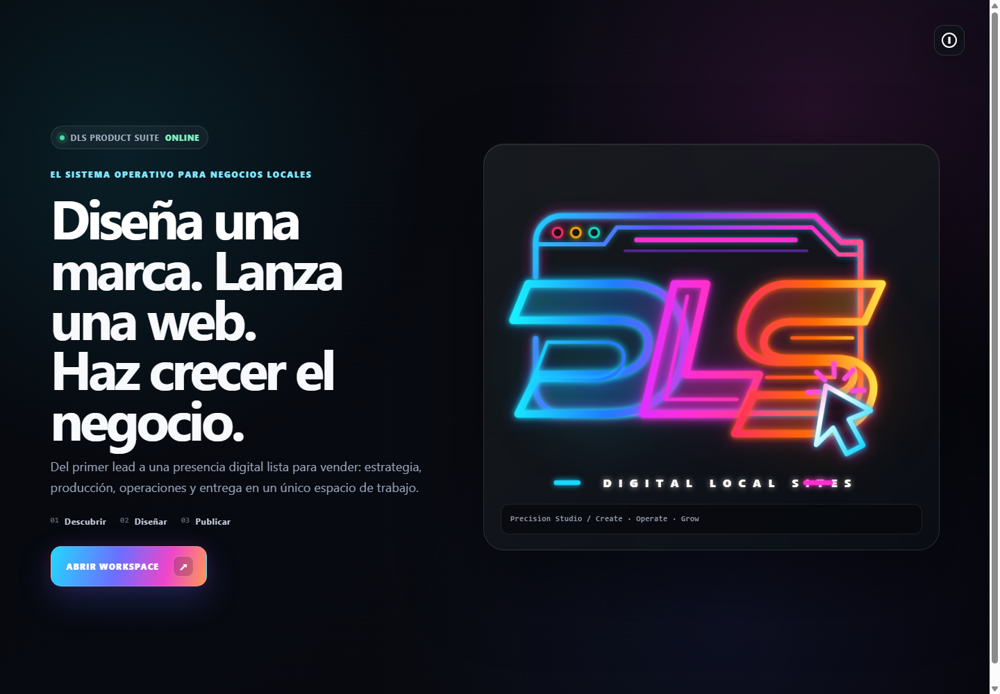

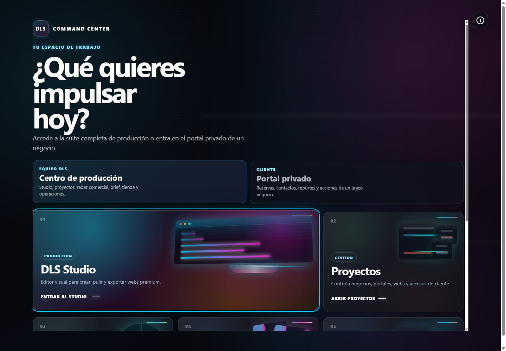

## 1.2 Problema abordado, según el sistema observable

**Inferencia con evidencia suficiente.** Los textos de interfaz, el catálogo de módulos y los flujos conectados indican que el sistema intenta reducir la fragmentación entre la creación de una web y la operación cotidiana de un negocio local. La solución reúne en una misma base técnica la producción del sitio, la captación de contactos, la agenda, el seguimiento comercial y los informes. Esta formulación describe la intención observable del producto; no sustituye a la motivación personal o académica del autor, que debe confirmarse.

## 1.3 Alcance actual

El alcance confirmado incluye:

- edición y previsualización de webs;
- layouts, imágenes, control de calidad y exportación;
- publicación de demos local o remota configurable;
- inventario multi-negocio y portal de cliente;
- prospección Radar y traspaso de oportunidades;
- CRM, pipeline, scoring, timeline y siguientes acciones;
- propuestas y plantillas de mensajes;
- servicios, reservas, disponibilidad, bloqueos y recordatorios;
- eventos y reportes operativos/comerciales;
- integración técnica con varias APIs de Google;
- persistencia JSON/PostgreSQL;
- seguridad HTTP, autenticación y logging;
- configuración Docker, Render y Cloudflare opcional.

Quedan fuera de lo que puede afirmarse como productivo: cuentas externas activas, usuarios o clientes reales, métricas de conversión, cumplimiento jurídico integral, Stripe/Resend/OpenAI desplegados y existencia de un servicio público concreto.

# 2. Metodología de auditoría y redacción

## 2.1 Principio de fuente de verdad

La jerarquía aplicada ha sido: comportamiento reproducido y pruebas ejecutadas; código conectado a puntos de entrada; configuración; inferencia explícita; documentación histórica. Un nombre de archivo, una dependencia instalada o un comentario no se consideraron suficientes para dar una funcionalidad por implementada.

Para cada módulo se comprobó, en la medida permitida por el entorno, su conexión con un punto de entrada, su activación desde la interfaz o el router, el tratamiento de datos y errores, la persistencia asociada y la existencia de pruebas. Los documentos antiguos solo se usaron para detectar evolución y contradicciones.

## 2.2 Inspección estática

La inspección cubrió el árbol del repositorio, manifiestos, HTML, CSS, JavaScript, servidor, APIs, librerías, scripts, datos de ejemplo, contenedores, configuración de despliegue, Worker, workflows y documentación. Se rastrearon importaciones, scripts cargados y referencias a módulos. El repositorio contiene 1.644 archivos rastreados por Git; 1.401 están bajo `node_modules`, una anomalía de mantenimiento pese a que `.gitignore` ya excluye esa carpeta.

## 2.3 Ejecución controlada

Se dedujeron los comandos desde `package.json`. La aplicación se ejecutó con Node.js y el servidor real. Para las capturas se creó un directorio de trabajo temporal, se forzó `BUSINESS_STORE=json`, se anularon las URLs de PostgreSQL, se desactivaron backups y se usó un fixture ficticio. El proceso no cargó el `.env` del proyecto y se cerró al finalizar.

El fixture representa “Luma Café — entorno de prueba” y usa `example.test`, teléfonos no reales y textos que avisan del carácter simulado. El endpoint de salud confirmó el modelo cargado antes del recorrido visual.

## 2.4 Pruebas

Se ejecutaron la validación sintáctica, suites Studio y backend, smoke funcional, QA visual y prueba de navegador. Los resultados se explican en el capítulo 15 y en el anexo de pruebas. “Prueba superada” se limita al alcance de sus aserciones; no se equipara una simulación de proveedor con una cuenta productiva.

## 2.5 Evidencia visual

Las dieciséis figuras proceden de la aplicación ejecutada. Antes de cada captura se esperó al DOM requerido y a la estabilización de imágenes. Las capturas de formularios no se usan como única evidencia de procesamiento: se relacionan con rutas API y pruebas funcionales. El catálogo completo se conserva en `anexos/inventario_capturas.md`.

# 3. Visión general del sistema

## 3.1 Áreas funcionales

DLS se organiza en tres planos conectados:

1. **Producción interna:** brief, Radar, Studio y proyectos.
2. **Operación del negocio:** portal, CRM, agenda, propuestas, mensajes, Google e informes.
3. **Canal público:** web generada, formularios, reservas, eventos, chatbot y tienda visual.

El mismo registro de negocio actúa como nexo. Contiene identidad, marca, contenido, integraciones y configuración. El backend asocia contactos, actividades, propuestas, servicios, reservas y eventos mediante `businessId`.

## 3.2 Actores deducidos

**Inferencia.** El código distingue al menos tres roles operativos, aunque no implementa un IAM completo:

- equipo administrador DLS, autenticado mediante token admin;
- cliente de un negocio, autenticado con contraseña y token limitado al negocio/áreas;
- visitante público, que accede a la web y a endpoints de captación, reservas y eventos con rate limit.

No hay una tabla general de usuarios internos ni una matriz completa de roles. Los roles `owner`, `admin`, `editor` y `viewer` aparecen en SQL de Supabase documental, no en el runtime actual.

## 3.3 Estado observado

El Studio, Radar demo, proyectos, portal, web de cliente, informe y onboarding cargaron correctamente. La figura 3 muestra que la vista de proyectos obtiene el negocio del servidor, en lugar de limitarse a HTML estático.

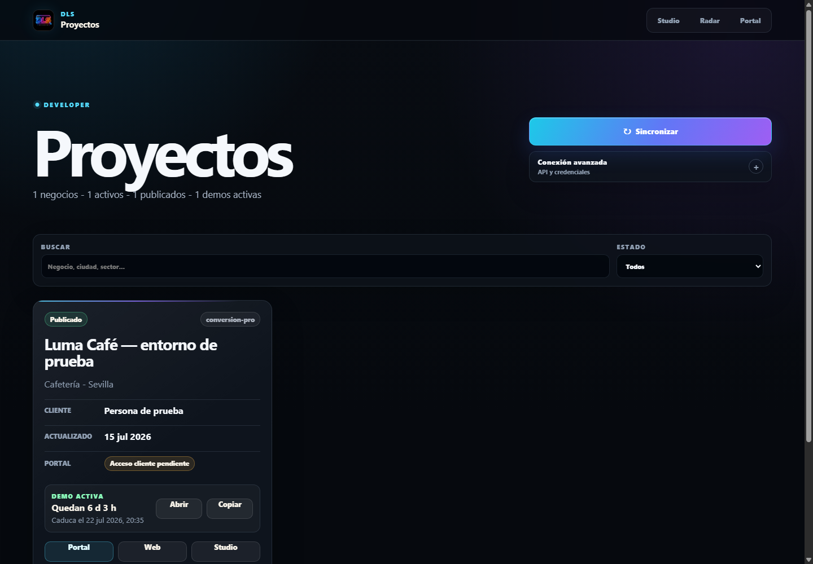

# 4. Arquitectura

## 4.1 Vista lógica

La arquitectura se deduce como un monolito modular ligero con frontend multipágina y extensiones externas opcionales.

```text
┌──────────────────────────────── Navegador ────────────────────────────────┐
│ Studio │ Radar │ Proyectos │ Portal │ Web cliente │ Informe │ Brief      │
│ módulos DOM + namespace LocalLiftStudio + fetch JSON                     │
└───────────────────────────────┬───────────────────────────────────────────┘
                                │ HTTP/JSON
┌───────────────────────────────▼───────────────────────────────────────────┐
│ Servidor Node nativo                                                      │
│ router modular · auth · CORS · guards · rate limit · logging             │
│ negocios · CRM · agenda · propuestas · informes · Google · imágenes      │
└───────────────────────────────┬───────────────────────────────────────────┘
                                │ adaptador
                 ┌──────────────┴──────────────┐
                 │ JSON atómico │ PostgreSQL   │
                 └──────────────┬──────────────┘
                                │ opcional
        Google · OSM · bancos de imagen · Cloudflare · servicios separados
```

El servidor principal se inicia con `node server/server.mjs`. No se requiere compilación ni bundle para el frontend. Esta simplicidad favorece la inspección y la exportación standalone, pero traslada al navegador la responsabilidad de cargar scripts en orden.

## 4.2 Puntos de entrada

- `index.html`: entrada del Studio y centro de destinos.
- `server/server.mjs`: servidor estático y router de API.
- `pages/business-dashboard.html`: portal operativo.
- `pages/business-radar.html`: prospección.
- `pages/projects.html`: gestión de proyectos.
- `pages/client-site.html`: web generada desde un registro.
- `pages/monthly-report.html`: salida imprimible.
- `pages/onboarding.html`: brief.
- `pages/store-admin.html`: cliente de un backend de comercio separado.
- `examples/commerce-api.example.mjs` y `examples/chatbot-api.example.mjs`: procesos opcionales de ejemplo.

## 4.3 Organización frontend

Los módulos Studio publican funciones en `window.LocalLiftStudio`. `src/app.js` consume utilidades, estado, layouts, medios, datos, renderer, exporter, validación, QA, stock y estilos de botón. La estrategia permite que `pages/client-site.html` cargue `core-utils`, `catalog` y `renderer` sin empaquetador.

El principal riesgo estructural es el tamaño del orquestador. `src/app.js` contiene aproximadamente 6.893 líneas y 253.766 bytes. El proyecto define un guard de 180.000 bytes, por lo que la propia prueba confirma una regresión de modularidad. El hallazgo no significa que el Studio no arranque; significa que la frontera arquitectónica acordada no se respeta.

## 4.4 Organización backend

`server/server.mjs` importa manejadores para salud, stock, autenticación, reservas, Google, plantillas, propuestas, bandeja, reportes, QA, imágenes, demos, eventos, contactos, descubrimiento y negocios. Cada módulo reconoce rutas y métodos, valida autorización y opera sobre el store común.

La solución no usa Express. El control HTTP —cuerpo, CORS, cabeceras, rutas y errores— se implementa con módulos propios. Esto reduce dependencias pero aumenta la cantidad de infraestructura que debe mantenerse y probarse internamente.

# 5. DLS Studio y generación web

## 5.1 Edición y preview

El Studio reúne controles de contenido, dirección visual, orden de secciones, biblioteca de bloques, imágenes, responsive y preparación de entrega. El renderer genera la web dentro de un marco de navegador. La figura 4 muestra el editor y un preview realmente renderizado; no es una maqueta incorporada a la memoria.

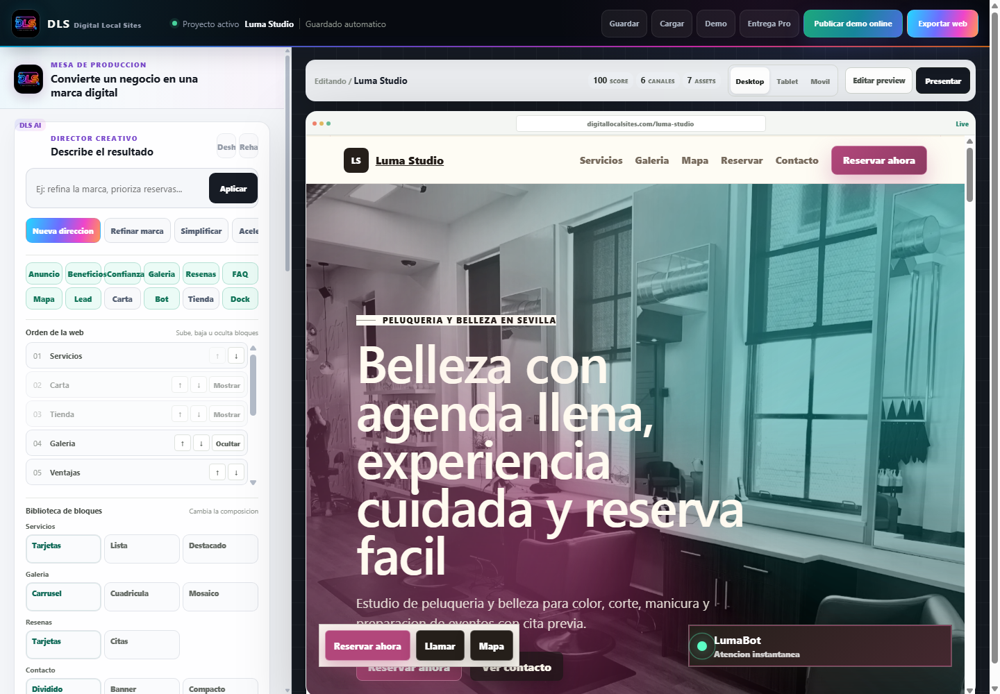

La aplicación proporciona historial, undo/redo y autosave sobre `localStorage`. El botón de guardado conserva una copia local y, si existe contexto API, sincroniza el negocio con el backend. También puede cargar desde almacenamiento local o desde la API.

## 5.2 Modelo visual

El catálogo permite combinar tema, dirección artística, tipografía, densidad, forma, proporción de imagen y variantes de bloques. El renderer normaliza esos valores y produce una estructura `.generated-site` con clases de tema y composición. El código responsive se comparte entre Studio, web de cliente y exportación.

La figura 5 muestra el cambio de viewport dentro del Studio. Esta evidencia demuestra que el control de viewport responde y que el CSS adapta la composición; no sustituye a una auditoría exhaustiva en todos los dispositivos.

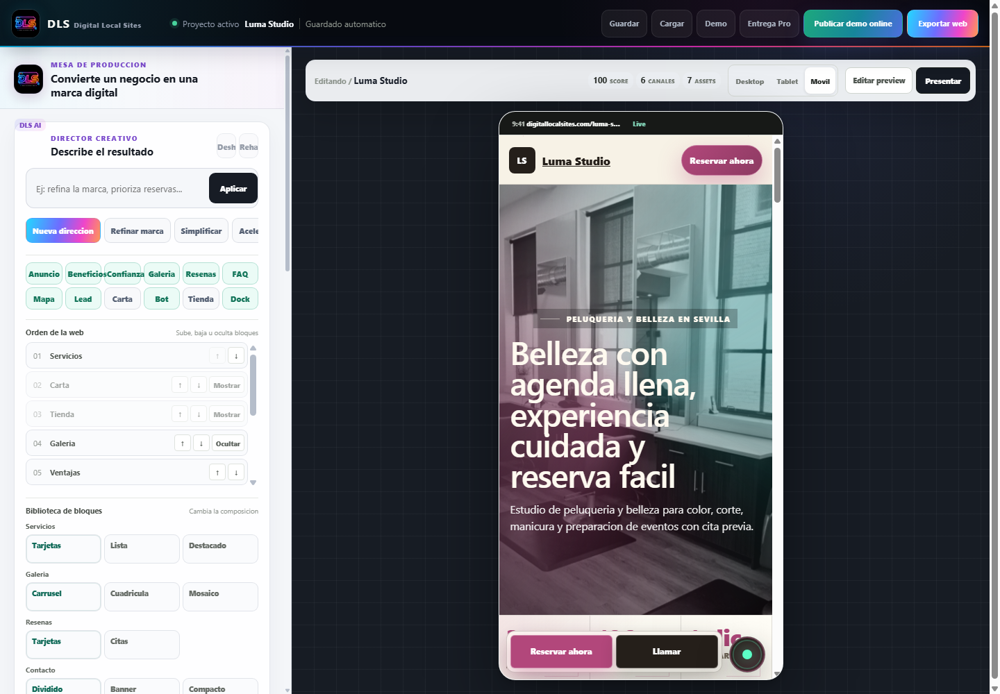

## 5.3 Recursos e imágenes

El Studio contiene una colección curada y dos APIs de servidor:

- stock genérico, con Unsplash si hay clave y Wikimedia Commons como alternativa;
- packs de imágenes de sitio, capaces de consultar Unsplash, Pexels y Pixabay según credenciales;
- seguimiento del endpoint de descarga exigido por Unsplash;
- normalización de URLs, proveedores, autoría y licencia mostrada.

Las pruebas sustituyen las llamadas externas para comprobar selección y formato. No se ha verificado la licencia final de cada imagen incluida históricamente en catálogos; debe revisarse antes de una explotación pública.

## 5.4 Validación y entrega

La validación del negocio, el control de calidad y la QA visual detectan campos incompletos, contraste, estructura, imágenes y preparación de entrega. La salida puede adoptar tres formas:

- HTML standalone descargable;
- datos JSON reutilizables;
- paquete ZIP con HTML, `business.json`, ficha y registro de cambios.

El mismo renderer se usa para preview y salida, lo que reduce divergencias. La publicación de demo es una operación diferente: guarda HTML en filesystem o lo envía a un publicador remoto con TTL. La interfaz explica esta separación.

# 6. Onboarding y Radar

## 6.1 Brief de onboarding

El onboarding divide la entrada de información en identidad, conversión, contenido, recursos, chatbot y entrega. El progreso se calcula a partir de campos clave y el resultado puede transferirse al Studio. La figura 6 muestra el primer paso del flujo; el procesamiento se acredita además por el código de handoff.

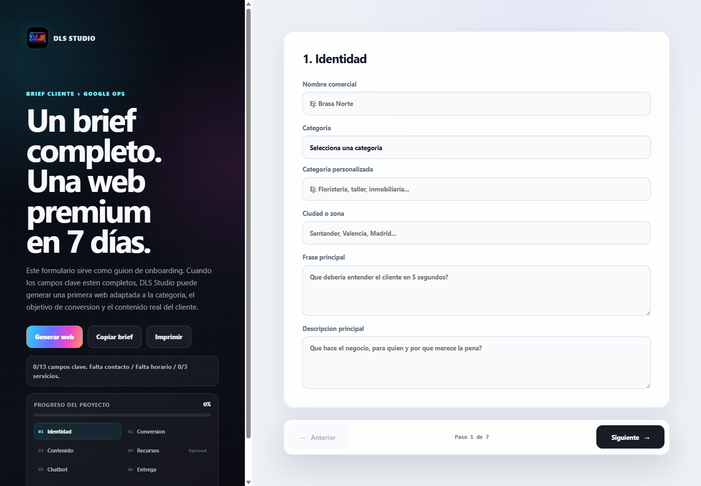

## 6.2 Descubrimiento de oportunidades

Radar dispone de un proveedor de demostración y un proveedor OpenStreetMap. En modo OSM, el backend y el cliente usan servicios geográficos para buscar negocios; el cliente calcula señales de oportunidad y muestra lista, métricas, recomendaciones y mapa. La ausencia de una web declarada en la fuente no se interpreta como certeza absoluta de que el negocio no tenga web.

La captura se realizó en modo demo para evitar depender de red y de datos de terceros. La propia interfaz muestra “Ejemplo · datos simulados”, por lo que no debe presentarse como una búsqueda real.

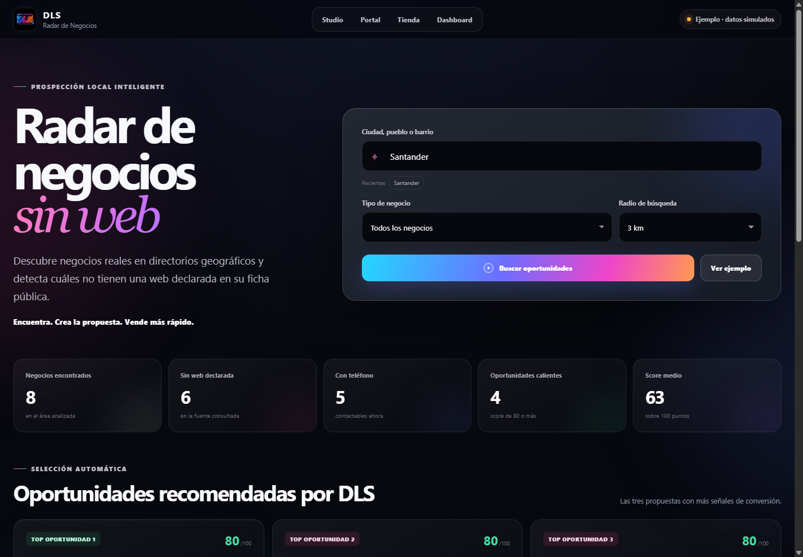

## 6.3 Traspaso al Studio

Una oportunidad puede transformarse en brief: se normalizan nombre, categoría, localidad, señales, datos de contacto y recursos. El endpoint `/api/studio/from-opportunity` y el módulo `studio-handoff` conectan las dos áreas. La prueba específica de handoff pasa. La integración no depende de que la búsqueda sea live: también se puede ensayar con fixture.

# 7. Portal operativo y CRM

## 7.1 Carga multi-negocio

El portal consulta `/api/businesses`, selecciona un negocio y carga en paralelo contactos, pipeline, acciones, servicios, reservas, disponibilidad, bloqueos, recordatorios, eventos, reportes, propuestas, plantillas, inbox y Google. La navegación por pestañas no es un conjunto de páginas inconexas: comparte un estado de negocio y un modelo derivado.

## 7.2 Bandeja diaria

La bandeja agrega vencimientos, leads sin primer contacto, reservas del día, propuestas pendientes y clientes a reactivar. En la figura 8 se observan los indicadores del fixture. El cálculo de secciones y sus acciones se prueba mediante las suites de inbox y automatización.

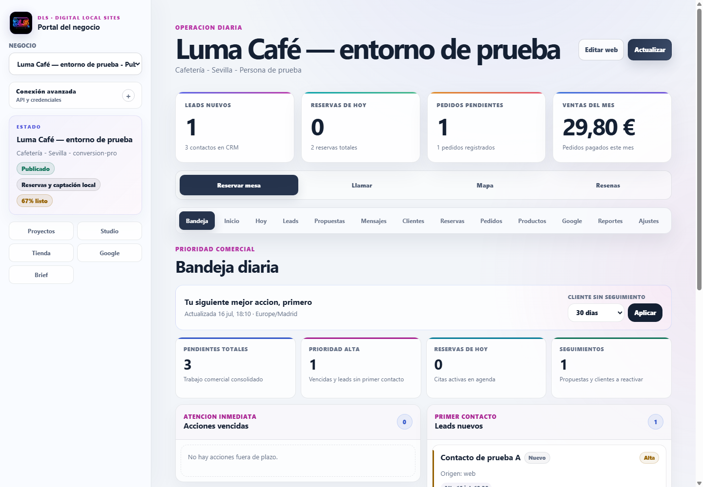

## 7.3 Contactos, pipeline y scoring

Los contactos almacenan identidad, canales, fuente, UTM, estado, motivo de pérdida, prioridad, orden, valor, privacidad, siguiente acción y score. La API permite:

- crear y actualizar contactos;
- agruparlos por pipeline;
- cambiar estado y orden;
- exigir motivo al marcar una pérdida;
- detectar duplicados y fusionarlos de forma blanda;
- registrar actividades y timeline;
- programar o modificar siguiente acción;
- recalcular score.

La figura 9 representa contactos ficticios en distintas columnas. La deduplicación, los motivos de pérdida, el score y la persistencia no se dan por probados por la imagen: se apoyan en smoke y tests CRM.

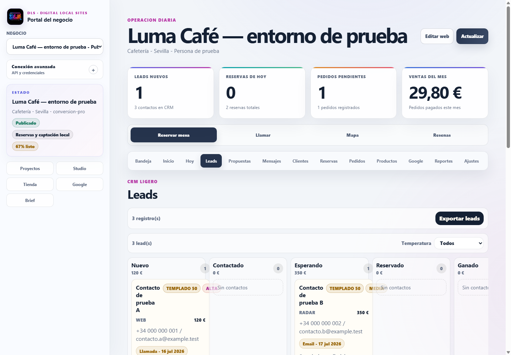

## 7.4 Propuestas

El módulo de propuestas enlaza una oferta a un contacto, con paquete, alta, cuota, condiciones, vencimiento y estado. La API aplica separación por negocio, transiciones, expiración y conversión. El exportador produce HTML y PDF. La figura 10 muestra la interfaz de creación; las pruebas de CRUD y exportación completan la evidencia.

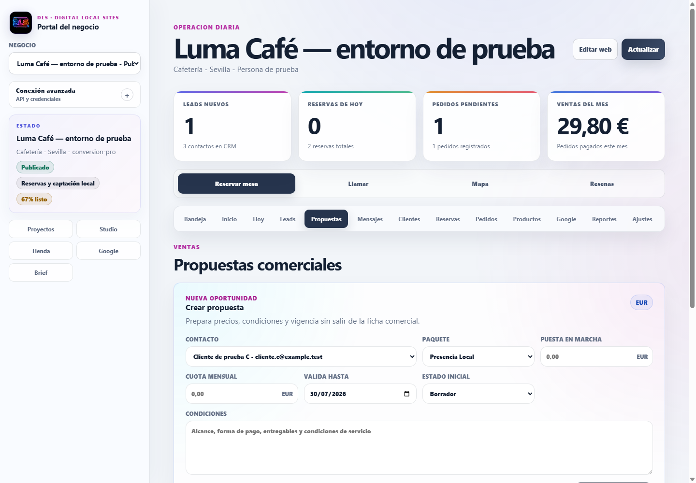

## 7.5 Mensajes

Las plantillas admiten tipo, etiqueta, asunto y cuerpo. El servidor sustituye variables con datos de negocio/contacto y genera enlaces `wa.me` o `mailto`. La funcionalidad confirmada es preparación y apertura del canal, no envío automático mediante WhatsApp Business o correo transaccional. El transporte real queda como integración externa futura.

# 8. Agenda y reservas

## 8.1 Entidades y reglas

La agenda combina servicios, reservas, reglas semanales, bloqueos manuales y recordatorios. Un servicio define duración, precio, descripción y estado. La disponibilidad determina intervalos por día; los bloqueos excluyen periodos; la reserva vincula servicio, contacto, datos del cliente, inicio/fin, origen y consentimiento.

## 8.2 Flujo público

El visitante envía una reserva al endpoint público del negocio. El backend:

1. valida cuerpo y consentimiento;
2. localiza negocio y servicio;
3. calcula fin según duración;
4. comprueba disponibilidad, bloqueos y solapes;
5. crea o relaciona el contacto;
6. persiste reserva y actividad;
7. devuelve el resultado.

El smoke ejecutó el flujo con datos temporales y creó un recordatorio. La figura 11 muestra el estado de agenda del fixture, incluidos horarios y un bloqueo ficticio.

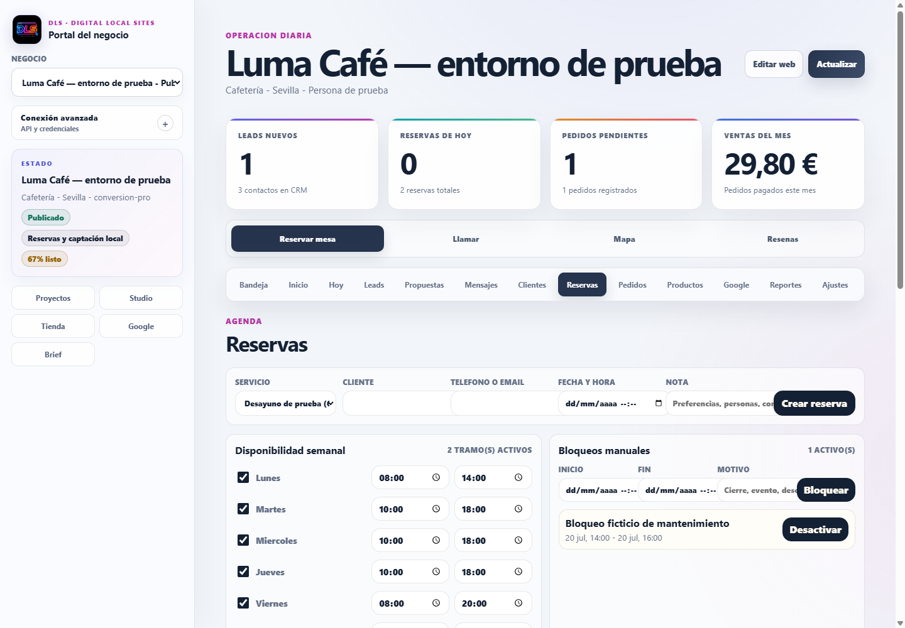

## 8.3 Recordatorios y Calendar

Los recordatorios se preparan por canal y quedan en una cola con estado; no se envían mediante un proveedor de mensajería en el servidor principal. Google Calendar puede consultar free/busy, crear eventos y sincronizar una reserva cuando existe OAuth. Ese último flujo no se ejecutó con una cuenta real.

# 9. Web pública, conversión y responsive

## 9.1 Renderer compartido

`pages/client-site.html` carga utilidades, catálogo y renderer del Studio. Obtiene el registro de negocio desde la API, lo convierte al modelo visual y monta la web. A continuación conecta formularios de lead, reserva, carrito, chatbot y eventos.

La figura 12 utiliza un registro ficticio y muestra un aviso inequívoco de demostración. Esto evita confundir la evidencia con un cliente real.

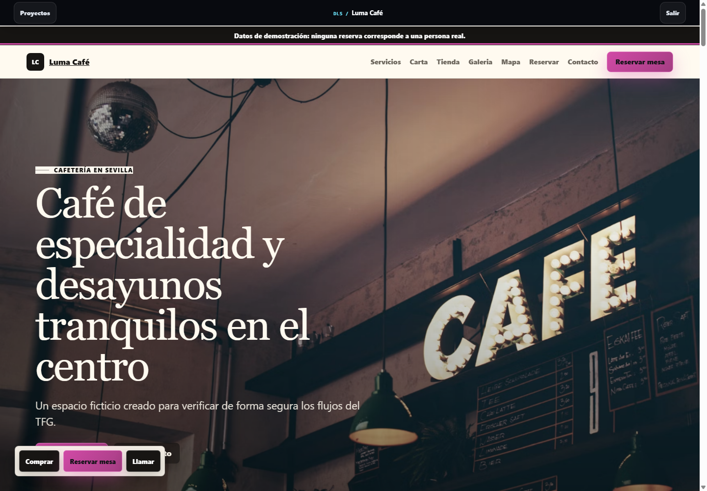

## 9.2 Captación y eventos

Los formularios públicos envían leads y reservas a rutas ligadas al slug del negocio. El evento de conversión registra nombre, detalle, UTM, página, referrer y agente. El rate limit separa categorías de endpoint. Los consentimientos de lead y reserva se almacenan y fueron verificados en el smoke.

## 9.3 Chatbot

El renderer admite chatbot local o remoto. En modo local, responde con reglas y contexto del negocio sin servicio externo. Si existe endpoint, envía la conversación a ese servicio. El ejemplo OpenAI demuestra cómo implementar un endpoint con Responses API, pero no forma parte del router principal.

## 9.4 Comercio visual

La web puede mostrar productos, carrito y acciones de checkout. El catálogo conserva productos embebidos como fallback. La validación y el checkout se derivan de endpoints configurables. El servidor principal no expone esas rutas; el backend Stripe reside en un ejemplo independiente que arranca, por defecto, en el puerto 8795. Por tanto, la memoria lo clasifica como extensión parcial, no como pago productivo confirmado.

## 9.5 Adaptación móvil

La figura 13 se capturó a 390×844. La navegación se vuelve desplazable, el hero reorganiza texto y acciones, y el dock de conversión permanece accesible. Se observa una salida real del renderer, no una imagen rediseñada para este documento.

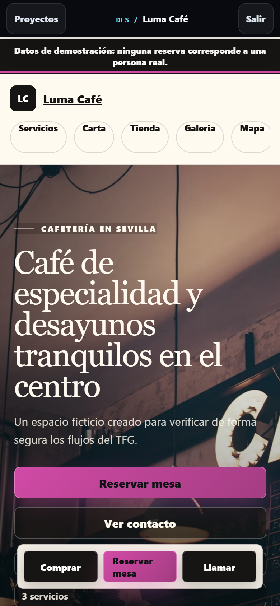

# 10. Informes y analítica

## 10.1 Reporte mensual

El endpoint mensual agrega contactos, reservas, recordatorios, pedidos y eventos para un periodo. El cliente imprime métricas, embudo, fuentes, estados de reserva, conversiones, actividad y recomendaciones. Los importes de comercio se derivan de pedidos almacenados en el modelo del negocio; no implican cobros Stripe reales.

La figura 14 muestra el resumen dentro del portal y la figura 15 la salida imprimible completa.

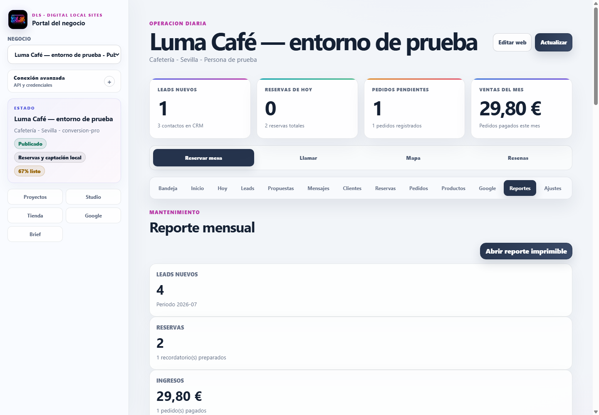

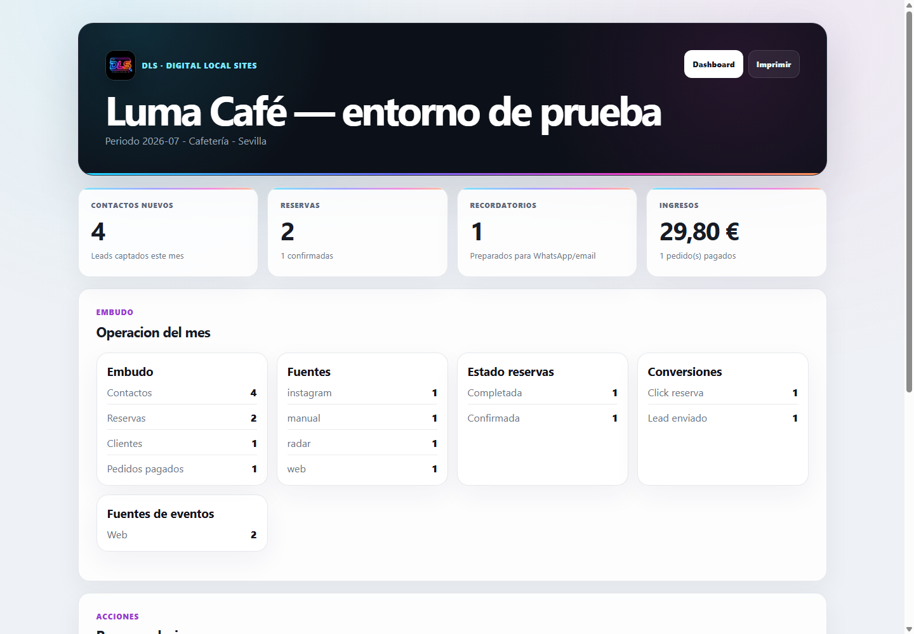

## 10.2 Informes comerciales adicionales

El backend ofrece:

- motivos de pérdida;
- forecast de oportunidades y propuestas;
- cumplimiento SLA y tiempos de primera respuesta;
- dashboard comercial agregado;
- calidad de datos;
- inbox operativo.

Las pruebas verifican separación por negocio, fechas, agregaciones y casos límite. Estos informes no se traducen en una métrica académica de impacto: describen datos operativos del modelo.

## 10.3 Exportación

El dashboard permite exportar contactos, leads y reservas en CSV. Las propuestas tienen salida HTML/PDF y el informe mensual puede imprimirse. La memoria evita afirmar que existe un pipeline de BI externo o almacenamiento analítico separado, porque no aparece en el runtime.

# 11. Persistencia y modelo de datos

## 11.1 Persistencia JSON

El modo JSON guarda un documento agregado con colecciones de negocios, contactos, actividades, propuestas, plantillas, servicios, reservas, disponibilidad, bloqueos, recordatorios, eventos y auditoría. La escritura se realiza a un temporal y después se renombra, evitando reemplazos parciales. Los backups son configurables.

Este modo es apropiado para desarrollo y demostraciones controladas. Su principal límite es la coordinación entre procesos: la atomicidad del archivo no equivale a control relacional o transaccional multiinstancia.

## 11.2 Persistencia PostgreSQL

El store PostgreSQL crea una tabla por colección. Cada fila guarda identificadores e índices básicos junto con `data JSONB`. La operación de reemplazo usa transacción y `pg_advisory_xact_lock`; una tabla meta conserva información general. Render configura `BUSINESS_STORE=postgres` e inyecta `DATABASE_URL`.

**Inferencia.** El diseño migra el documento a una infraestructura concurrente sin normalizar todas sus relaciones. Esta decisión reduce el acoplamiento de una migración temprana, aunque la integridad referencial depende principalmente de la aplicación.

## 11.3 Modelo resumido

| Entidad | Relaciones y finalidad |
|---|---|
| Negocio | Raíz de tenant; marca, contenido, configuración, integraciones y demo. |
| Contacto | Pertenece a negocio; participa en pipeline, propuestas, reservas y actividades. |
| Actividad | Historial de contacto y fuente de timeline/SLA. |
| Propuesta | Pertenece a negocio y contacto; representa oferta y transición comercial. |
| Plantilla | Pertenece a negocio; prepara mensajes personalizados. |
| Servicio | Pertenece a negocio; define duración/precio de reserva. |
| Reserva | Pertenece a negocio, contacto y servicio. |
| Disponibilidad/bloqueo | Regulan la agenda del negocio. |
| Recordatorio | Pertenece a reserva y negocio. |
| Evento | Señal pública asociada a negocio y contexto de atribución. |
| Auditoría | Registra mutaciones relevantes. |

## 11.4 Tenancy

La separación se implementa aplicando `businessId` en lecturas y escrituras, y autorizando el token cliente contra un negocio/slug y áreas. Las pruebas de propuestas, reportes y CRM incluyen escenarios de dos tenants. No existe un esquema por tenant ni Row Level Security de base de datos en el runtime.

# 12. Integraciones externas

## 12.1 Google

El backend principal contiene OAuth por negocio, callback, refresh, desconexión, diagnósticos, Places, Calendar, Business Profile y Workspace. Los tokens se cifran con AES-256-GCM; el estado OAuth se guarda como hash con una vida de diez minutos.

La figura 16 es deliberadamente una evidencia de estado no configurado. Muestra botones y diagnósticos del módulo, pero también que OAuth, cifrado y Places no están preparados en el entorno. No se incluye una captura inventada de conexión exitosa.

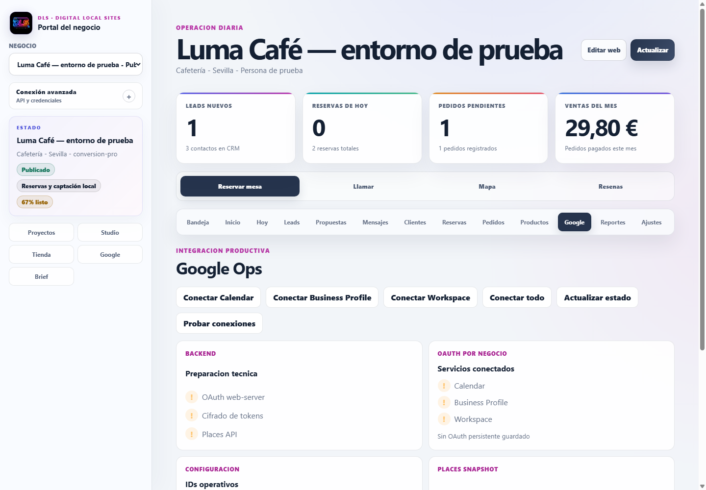

Las pruebas Google usan respuestas simuladas. Permiten afirmar que el código forma solicitudes y procesa respuestas, no que una cuenta de Google haya concedido scopes o que Business Profile esté habilitado.

## 12.2 Geografía y mapas

Radar utiliza OpenStreetMap como modo por defecto, Nominatim/Overpass para descubrimiento y Leaflet/MarkerCluster para mapa. Leaflet se carga desde unpkg; una caída o restricción del CDN afecta al mapa, aunque el listado puede seguir procesándose.

## 12.3 Proveedores visuales

Unsplash, Wikimedia Commons, Pexels y Pixabay aportan imágenes según configuración. El backend filtra y normaliza URLs y conserva metadatos. Para una entrega pública debe mantenerse la atribución y revisar las condiciones de cada proveedor.

## 12.4 Cloudflare

El Worker permite publicar HTML en KV con caducidad y token compartido. Replica cabeceras de seguridad. Los tests locales pasan. No hay evidencia de que el Worker esté desplegado ni de que un dominio esté vinculado.

## 12.5 Integraciones de ejemplo

El backend de comercio incluye Stripe Checkout, webhooks, stock, cupones, pedidos y Resend. El chatbot de ejemplo llama a OpenAI Responses. Ambos son técnicamente relevantes como prototipos de integración, pero se ejecutan al margen del servidor principal. Esta distinción evita convertir ejemplos en funcionalidades productivas por el mero hecho de que exista código.

# 13. Seguridad

## 13.1 Autenticación administrativa

Las rutas sensibles aceptan Bearer o `X-LocalLift-Admin-Token`. La comparación usa `timingSafeEqual`. En desarrollo, la ausencia de token permite el modo local abierto; en producción el validador exige una credencial. Este comportamiento facilita el uso local, pero requiere controlar correctamente `NODE_ENV`.

## 13.2 Autenticación de cliente

Las contraseñas se almacenan como `scrypt:salt:hash`. Tras verificarla, el servidor genera un token con payload y firma HMAC SHA-256; el TTL por defecto es de catorce días. El cliente lo conserva en `localStorage` y lo envía en una cabecera. El backend limita el negocio y las áreas permitidas.

Riesgo: `localStorage` no es inmune a XSS. La medida complementaria debe ser reducir inyección y endurecer la política de contenido. En el corte actual, la CSP todavía permite scripts y estilos inline.

## 13.3 Seguridad HTTP

El servidor aplica:

- rechazo de TRACE;
- límite de URL y cuerpo;
- exigencia de JSON en métodos mutantes;
- CORS configurable;
- CSP, `nosniff`, `SAMEORIGIN`, políticas de referrer/permisos y HSTS en producción;
- `Cache-Control: no-store` para API;
- prevención de path traversal;
- límites por IP y categoría de endpoint;
- mensajes de error estructurados sin exponer la traza al cliente.

Los límites viven en memoria y no se comparten entre réplicas. Además, el primer `X-Forwarded-For` se acepta sin una política explícita de proxies de confianza. Son límites relevantes si el sistema escala.

## 13.4 Secretos y OAuth

El `.env` está ignorado por Git. Durante la auditoría solo se comprobó la presencia de nombres de variables, nunca sus valores. Los tokens Google se cifran; el logger redacta claves cuyo nombre parece sensible. La CI incluye auditoría de dependencias y un script busca patrones de secretos.

No puede demostrarse desde el repositorio que ningún secreto histórico haya sido filtrado o que todos los proveedores hayan rotado claves. Tampoco se verificó WAF, DNS o backup externos.

## 13.5 Privacidad

Los endpoints públicos almacenan aceptación, fecha y URL de política para leads/reservas. Esto es una base técnica, no una certificación RGPD. Faltan evidencias externas sobre base jurídica, información al interesado, contratos, conservación, ejercicio de derechos y procedimientos reales.

# 14. Ejecución, configuración y despliegue

## 14.1 Comandos comprobados

- `npm start`: servidor local.
- `npm run start:prod`: valida el entorno y arranca.
- `npm run check`: sintaxis.
- `npm run smoke:pilot`: smoke funcional aislado.
- `npm run test:studio`: suite compuesta Studio.
- scripts CRM, Google, seguridad, QA y despliegue específicos.

El proyecto declara solo tres dependencias npm directas: Atropos, `pg` y Stripe. Parte de las librerías visuales se guarda en `assets/vendor` y no requiere descarga en runtime.

## 14.2 Variables

La configuración cubre host/puerto, entorno, token admin, sesión cliente, store, PostgreSQL, backups, CORS, rate limits, Google, proveedores de imagen, publicador de demos y logging. Las variables reales no se incluyen en la memoria.

## 14.3 Docker y Render

El contenedor usa Node 22 Alpine, instala dependencias de producción, expone el servidor y define healthcheck. El Blueprint de Render configura un servicio web, PostgreSQL gestionado, disco persistente y un cron de automatización diaria.

**Clasificación:** esto confirma preparación de despliegue. Sin URL, panel o respuesta externa no confirma que Render esté ejecutando este commit.

## 14.4 Operación

El healthcheck devuelve estado, latencia, store, contadores y preparación Google sin mostrar secretos. El logging produce JSON con request ID y redacción. Hay scripts de migración JSON→PostgreSQL, restauración y automatización CRM. La restauración de una base productiva no fue ensayada.

# 15. Verificación y calidad

## 15.1 Resultados positivos

La validación sintáctica finalizó sin errores. El smoke levantó un servidor temporal, protegió rutas admin, creó y deduplicó un lead con consentimiento, registró eventos, creó una reserva válida, generó recordatorio y timeline, ejercitó scoring, pérdida, merge, pipeline, reportes y preparación Google. Su salida final fue:

```text
Pilot smoke test passed.
Health: ok; contacts: 6; bookings: 1; events: 1.
Verified: admin auth, lead consent, booking consent, status changes,
monthly reports and Google readiness.
```

También pasaron las suites de seguridad backend, Google simulada, timeline, propuestas, plantillas, forecast, automatización, inbox, SLA, dashboard, atribución, calidad de datos, imágenes y handoff Radar. La QA visual profunda pasó de forma independiente.

## 15.2 Guard de arquitectura

La suite Studio pasa sus bloques de core, estado, layouts, medios, stock, publicación, worker, datos, validación y renderer. Se detiene en:

```text
src/app.js must remain below 180 KB; current size is 253766
```

El fallo es valioso: demuestra que el control detecta una desviación. La solución no debe ser elevar silenciosamente el límite, sino extraer responsabilidades y mantener pruebas sobre los nuevos módulos.

## 15.3 Navegador E2E

`test:studio-browser` abre un navegador CDP y pretende recorrer edición directa, layouts, historial, entrega y descargas. En dos intentos controlados el target se cerró mientras esperaba `document.documentElement.dataset.studioReady`. Por ello no se afirma que esa secuencia haya pasado.

Un capturador más corto sí cargó el Studio, esperó el mismo indicador, cambió a viewport móvil y generó figuras válidas. La diferencia sugiere una interacción entre el perfil de flags, recursos y estabilidad del navegador, pero la causa exacta no se determina en esta memoria.

## 15.4 Ausencias de calidad

No se encontró:

- informe de cobertura de líneas/ramas;
- prueba de carga o concurrencia;
- pentest independiente;
- prueba de restauración de PostgreSQL real;
- matriz completa WCAG con lector de pantalla;
- evaluación UX documentada con participantes;
- monitorización productiva con métricas y alertas externas.

Estas ausencias son líneas de mejora, no pruebas de que el sistema falle en todos esos ámbitos.

# 16. Evolución y contradicciones documentales

## 16.1 De JSON a persistencia dual

La memoria anterior describía JSON como base del MVP y PostgreSQL como futuro. El estado actual conserva JSON y añade un driver PostgreSQL, migrador y configuración Render. La evolución es observable en código; la fecha o motivación exacta requiere confirmación del autor.

## 16.2 De Google ejemplo a módulo principal

Los planes antiguos situaban OAuth Google y Business Profile como trabajo posterior. El backend actual contiene el flujo completo de autorización, cifrado y rutas operativas. La disponibilidad real de cuentas y APIs continúa sin verificar.

## 16.3 Crecimiento de pruebas

Una versión histórica proponía “añadir pruebas automatizadas”. El repositorio actual expone 34 scripts y aproximadamente 1.012 usos de `assert`. El número muestra evolución, pero no equivale a cobertura.

## 16.4 Regresión de modularidad

`docs/AHORA.md` afirma que `src/app.js` había bajado a 156 KB. El corte actual alcanza 253.766 bytes. La contradicción se resuelve a favor del archivo y del guard ejecutado. Esto ilustra por qué la memoria no puede basarse en un documento de estado sin volver a medir.

## 16.5 Supabase

`docs/CIBERSEGURIDAD.md` enumera Supabase DB/Auth como stack, mientras que otros documentos del propio repositorio reconocen que no hay SDK ni instancia verificable. El runtime usa PostgreSQL directo o JSON; el SQL RLS queda como preparación futura.

# 17. Limitaciones y deuda técnica

## 17.1 Deuda prioritaria

1. **Modularizar `src/app.js`.** Extraer publicación, comercio, chatbot, acciones rápidas, entrega y coordinación de UI.
2. **Estabilizar el E2E de navegador.** Reducir flags, capturar logs/crash dumps, separar escenarios y ejecutarlo en CI con navegador fijado.
3. **Limpiar el índice Git.** Retirar `node_modules` rastreado mediante un cambio controlado y verificar reproducibilidad con `npm ci`.
4. **Aclarar el alcance de comercio.** Integrar rutas en un servicio desplegado o etiquetar inequívocamente la tienda como extensión de ejemplo.
5. **Endurecer sesión/CSP.** Evaluar cookie HttpOnly/SameSite y reducir `'unsafe-inline'` cuando la arquitectura lo permita.
6. **Rate limit distribuido.** Sustituir memoria local si se usan réplicas.
7. **Revisar módulos huérfanos.** Confirmar el destino de `business-defaults.js`, `radar-review.js` e `intro-smoke.png`.
8. **Alinear documentación y scripts.** Actualizar estado, aceptación y alcance sin borrar el histórico.

## 17.2 Limitaciones de producto

- No hay administración multiusuario/roles completa.
- Mensajería automática real no está en el servidor principal.
- Comercio y chatbot remoto dependen de servicios separados.
- La conexión Google necesita credenciales, consentimiento y aprobación externa.
- No existe prueba de uso productivo o impacto comercial.
- La capa PostgreSQL no normaliza todas las relaciones.
- Parte de la UI depende de CDN/servicios externos.

## 17.3 Limitaciones de esta memoria

La auditoría no accedió a proveedores ni datos reales; no realizó pruebas jurídicas, de carga o pentest; y no puede reconstruir motivaciones históricas no registradas. El commit auditado tiene el asunto `BASURA`, por lo que el autor debe confirmar que sea el corte correcto para defensa.

# 18. Trabajo futuro propuesto

El trabajo futuro debe priorizar evidencia y riesgo:

## 18.1 Corto plazo

- corregir el guard de arquitectura mediante extracción real;
- hacer reproducible `test:studio-browser` en CI;
- decidir y documentar el servicio de comercio;
- verificar secrets, licencias y datos antes de publicar el repositorio;
- añadir una matriz de endpoints y permisos como contrato mantenible;
- limpiar dependencias versionadas.

## 18.2 Medio plazo

- introducir usuarios internos, roles y revocación de sesiones;
- añadir migraciones incrementales y restricciones relacionales;
- usar rate limit compartido y observabilidad externa;
- crear pruebas de restauración, carga y fallo de proveedores;
- reducir inline script/style y endurecer CSP;
- automatizar envío mediante proveedores elegidos, con auditoría y reintentos.

## 18.3 Validación externa

- ejecutar un piloto con consentimiento y objetivos medibles;
- definir métricas antes de observar resultados;
- realizar evaluación de accesibilidad con usuarios y tecnologías asistivas;
- documentar privacidad y conservación con asesoramiento adecuado;
- validar Google/Stripe/Cloudflare en entornos de prueba de proveedor;
- registrar commit, configuración no sensible y fecha de cada despliegue.

# 19. Conclusiones

DLS muestra una evolución desde un generador web hacia una suite operativa para negocios locales. La arquitectura actual combina un frontend multipágina sin framework pesado, módulos Studio compartidos, un backend Node nativo y persistencia dual. La continuidad entre web, captación, CRM, reservas e informes está respaldada por rutas, modelos y pruebas. El Studio y la web final comparten renderer, y el backend organiza dominios funcionales mediante manejadores independientes.

La evaluación también impone límites claros. Un archivo central excesivo incumple el guard arquitectónico; la prueba E2E larga no es estable en el entorno auditado; la configuración de despliegue no demuestra un despliegue real; y las integraciones externas presentan grados de madurez distintos. Google puede describirse como implementación conectada y simulada, mientras que Stripe, Resend y OpenAI deben permanecer como extensiones de ejemplo o configurables.

La principal aportación técnica observable es la integración de producción y operación en un sistema portable, capaz de funcionar localmente con JSON y de migrar a PostgreSQL. La siguiente etapa no consiste solo en añadir funciones, sino en consolidar modularidad, identidad/roles, seguridad de sesión, observabilidad y validación externa. Esta conclusión se limita a la evidencia disponible y no atribuye resultados comerciales o de usuarios que el repositorio no contiene.

# 20. Fuentes técnicas del repositorio

## 20.1 Código y configuración primaria

1. `package.json`. Manifiesto, runtime, dependencias y scripts.
2. `index.html` y `src/app.js`. Entrada y orquestación Studio.
3. `src/studio/`. Utilidades, estado, layouts, medios, validación, renderer y exporter.
4. `src/business/` y `src/radar/`. Vistas operativas y prospección.
5. `server/server.mjs` y `server/api/`. Router y contratos HTTP.
6. `server/lib/`. Persistencia, autenticación, seguridad, logging y lógica de dominio.
7. `server/scripts/`. Pruebas, smoke, migración, validación y operaciones.
8. `Dockerfile`, `render.yaml`, `cloudflare/` y `.github/`. Despliegue y automatización.
9. `data/*.example.json`. Forma de datos de ejemplo.

## 20.2 Documentación histórica contrastada

1. `docs/AHORA.md`.
2. `docs/CIBERSEGURIDAD.md`.
3. `docs/referencia/LOCAL_LIFT_STUDIO_MEMORIA_TFG.md`.
4. `docs/operaciones/DEPLOYMENT.md`.
5. `docs/operaciones/SUPABASE_RLS_FASE_2.md`.
6. `docs/referencia/GOOGLE_INTEGRATION_PLAN.md`.

Estas fuentes históricas no prevalecen sobre el corte actual. Las contradicciones están registradas en `anexos/contradicciones_documentacion.md`.

# Anexo A. Ficha de reproducibilidad

| Elemento | Valor auditado |
|---|---|
| Commit | `8b123783eb2d8750aafdfa4a1e58d340ed82f6a3` |
| Fecha | 16/07/2026 |
| Node local | `v24.13.1` |
| npm local | `11.8.0` |
| Runtime declarado | Node `>=22.19` |
| Store de capturas | JSON aislado |
| Negocio | Luma Café — entorno de prueba |
| Datos reales | No utilizados |
| Servicios externos productivos | No consultados |
| Capturas | 16 |
| Smoke | Superado |
| QA visual | Superada |
| Guard arquitectura | Fallido por tamaño |
| E2E navegador largo | Fallido por cierre del target |

# Anexo B. Metadatos pendientes del documento

- **Título oficial:** [pendiente de confirmar].
- **Autor:** [pendiente de confirmar].
- **Tutor/a:** [pendiente de confirmar].
- **Titulación:** [pendiente de confirmar].
- **Centro/universidad:** [pendiente de confirmar].
- **Curso y convocatoria:** [pendiente de confirmar].
- **Norma de referencias:** [pendiente de confirmar].

# Anexo C. Declaración de tratamiento de evidencias

Las capturas se obtuvieron automáticamente a partir del runtime del repositorio. El fixture y el capturador quedan incluidos para reproducibilidad. No se alteró el código de la aplicación para aparentar una funcionalidad. No se sustituyeron flujos imposibles por imágenes generadas. Los servicios que requerían credenciales se documentaron con su estado no configurado o se trasladaron al listado de capturas no obtenidas.

La revisión final del PDF se documenta mediante las imágenes de `revision_pdf/` y su informe. Cualquier cambio posterior del código invalida la correspondencia exacta entre esta memoria y el sistema, por lo que debe registrarse un nuevo commit y repetir las comprobaciones relevantes.
